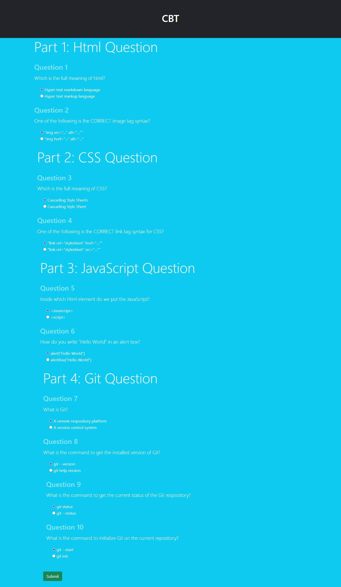

> ## CBT App


#### Link to the live website:
>[Test App](https://webdev-cbt.netlify.app/ "testapp live site")
___

#### Description 
>CBT App is a web app made with Js for doing computer based test, it can score a user based on the answer to the test. The demo questions used in this app was gotten frow w3schools.
____

#### Tech Used:
 >Html, CSS, JavaScript, git, github, Netlify.
___

> #### Things i have learnt: how to compare multiple Arrays and how to use the setInterval() and clearInterval().
```JavaScript
// Animating the score 
    let output  = 0;
    const timer = setInterval(() => {
        result.textContent = `${output}%`;
        if(output === score ){
            clearInterval(timer);
          
            // Designing the result
                if( output <= 40 ){
                    result.classList.remove('text-primary');
                    result.classList.add('text-danger');
                } else if (output <= 50) {
                    result.classList.toggle('text-primary');
                    result.classList.toggle('text-warning');
                }
                 else if (output <= 70 ) {
                    result.classList.toggle('text-primary');
                    result.classList.toggle('text-info');
                } else {
                    result.classList.remove('text-primary');
                    result.classList.add('text-success');
                }

        } else {
            output++;
        }
    }, 20);

});
```
---
> #### Desktop View



> #### Credits: 
NetNinja
Scythe